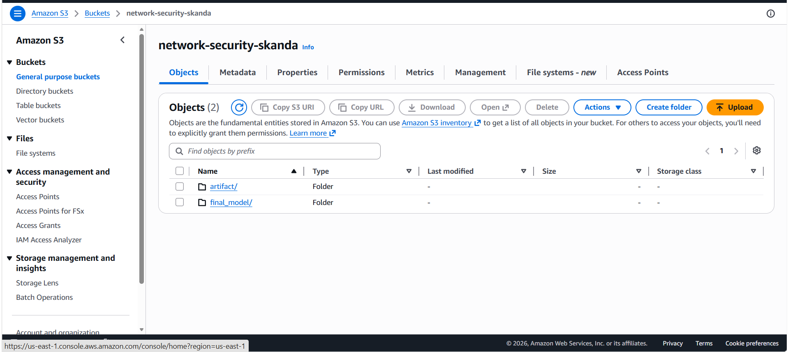
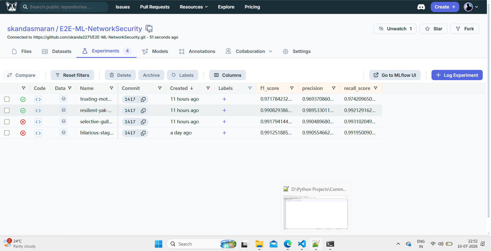
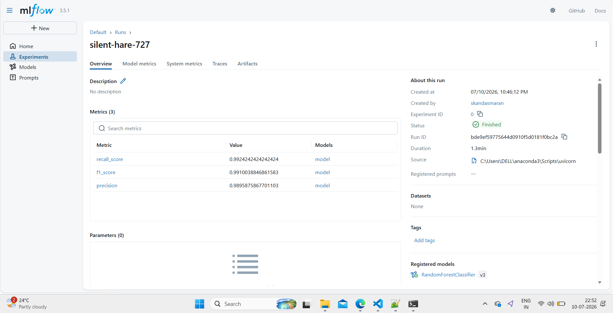

# E2E-ML-NetworkSecurity

This project is an end-to-end machine learning pipeline for network security data, focused on ingestion, validation, transformation, and preparation of phishing/network telemetry data for modeling.

> Use this README as an interview summary: it explains project structure, pipeline stages, files, tools, and debugging lessons.

## What this project does

- Reads network security data from MongoDB or CSV
- Converts raw data into structured artifacts
- Validates dataset schema and drift between train/test splits
- Transforms raw and validated data using KNN imputation
- Saves processed artifacts for downstream training
- Includes utilities for MongoDB ingestion, YAML config, logging, and exception handling

## Key files and purpose

### `main.py`
- Project entrypoint.
- Creates `TrainingPipelineConfig`, builds component configs, and executes the pipeline in sequence:
  1. `DataIngestion`
  2. `DataValidation`
  3. `DataTransformation`
- Uses `NetworkSecurityException` for consistent error handling.

### `push_data.py`
- Helper script to read `Network_data/phisingData.csv` and push CSV contents into MongoDB.
- Converts CSV rows to JSON records and inserts into the configured MongoDB collection.
- Useful for seeding the database before running the pipeline.

### `networkSecurity/components/data_ingestion.py`
- Reads raw data from MongoDB using `pymongo`.
- Drops MongoDB `_id` field and replaces string `"na"` values with `np.nan`.
- Saves the raw dataset to a feature store CSV.
- Splits data into train/test CSV files using `sklearn.model_selection.train_test_split`.
- Returns `DataIngestionArtifact` with train/test file paths.

### `networkSecurity/components/data_validation.py`
- Validates the ingested train and test CSV files.
- Checks if column count matches expected schema from `data_schema/schema.yaml`.
- Detects dataset drift using `scipy.stats.ks_2samp`.
- Writes a YAML drift report to artifacts.
- Saves validated train/test files and returns `DataValidationArtifact`.

### `networkSecurity/components/data_transformation.py`
- Reads validated train/test files.
- Drops the target column defined by `TARGET_COLUMN = "Result"`.
- Converts target values from `-1` to `0` for binary modeling.
- Builds a transformation pipeline with `KNNImputer`.
- Saves transformed train/test arrays as `.npy` and serializes the fitted preprocessor with `pickle`.
- Returns `DataTransformationArtifact`.

### `networkSecurity/entity/config_entity.py`
- Contains configuration classes for each pipeline stage:
  - `TrainingPipelineConfig`
  - `DataIngestionConfig`
  - `DataValidationConfig`
  - `DataTransformationConfig`
  - `ModelTrainerConfig`
- Automatically constructs artifact directories and file paths using constants from `networkSecurity.constant.training_pipeline`.

### `networkSecurity/entity/artifact_entity.py`
- Defines artifact dataclasses for pipeline outputs:
  - `DataIngestionArtifact`
  - `DataValidationArtifact`
  - `DataTransformationArtifact`
  - `ClassificationMetricArtifact`
  - `ModelTrainerArtifact`
- Enables typed return values and clear artifact passing between pipeline components.

### `networkSecurity/constant/training_pipeline/__init__.py`
- Holds reusable constants for pipeline configuration:
  - dataset and pipeline names
  - MongoDB collection/database names
  - artifact folder names
  - file names and schema path
  - KNN imputer parameters
  - model training thresholds
- Centralizes pipeline settings for reproducibility.

### `networkSecurity/logging/logger.py`
- Configures Python logging to a timestamped file under `logs/`.
- Uses a consistent log format and INFO level logging.

### `networkSecurity/exception/exception.py`
- Defines `NetworkSecurityException`.
- Captures traceback line numbers and file names for better debugging.

### `networkSecurity/utils/main_utils/utils.py`
- Utility functions for:
  - YAML read/write (`read_yaml_file`, `write_yaml_file`)
  - NumPy serialization (`save_numpy_array_data`, `load_numpy_array_data`)
  - Object serialization (`save_object`, `load_object`)
  - Model evaluation helpers (`evaluate_models`)
- Central helper file used across validation and transformation components.

## Data and EDA

### `Network_data/phisingData.csv`
- Dataset used for pipeline testing and local ingestion.
- Contains phishing/network security records that are transformed and split into train/test sets.

### Exploratory work
- EDA is implied by the existing pipeline and notebooks structure.
- Typical EDA tasks in this repo include:
  - inspecting feature distributions
  - checking for missing values
  - validating schema against `data_schema/schema.yaml`
  - detecting drift between train and test sets
- The `networkSecurity/notebooks` package exists for exploration and experiment notes.

## Tools and libraries used

- Python 3.x
- pandas
- NumPy
- scikit-learn
- scipy
- pymongo
- python-dotenv
- PyYAML
- pickle
- `logging` module
- `dataclasses`

## Setup and run instructions

1. Create and activate a virtual environment:

```powershell
python -m venv .venv
.\.venv\Scripts\Activate.ps1
```

2. Install dependencies:

```powershell
pip install -r requirement.txt
```

3. Create a `.env` file in the project root with your MongoDB URL:

```text
MONGO_DB_URL="your_mongodb_uri_here"
```

4. Seed MongoDB if needed with `push_data.py`:

```powershell
python push_data.py
```

5. Run the end-to-end pipeline:

```powershell
python main.py
```

## What we fixed during development

- Corrected Python import casing from `networksecurity` to `networkSecurity`.
- Fixed raw path handling for Windows file paths using raw strings: `r"Network_Data\phisingData.csv"`.
- Correctly accessed MongoDB collections via `database[collection_name]` instead of `client[collection_name]`.
- Ensured `DataTransformation` receives `DataValidationArtifact`, not the `DataValidation` component instance.
- Improved artifact handling so each stage returns typed results for the next stage.

## Troubleshooting

### Common errors

- `ModuleNotFoundError: No module named 'networksecurity'`
  - Use `networkSecurity` in imports.

- `SyntaxWarning: invalid escape sequence '\p'`
  - Use raw strings for Windows paths.

- `TypeError: 'Collection' object is not callable`
  - Ensure MongoDB collection is obtained from the `Database` object.

- `DataValidation object has no attribute 'valid_train_file_path'`
  - Pass the `DataValidationArtifact` output into `DataTransformation`.

### Checklist

- Confirm `MONGO_DB_URL` is correct.
- Confirm `Network_data/phisingData.csv` exists and matches `data_schema/schema.yaml`.
- Ensure the Python virtual environment is active.

## Interview talking points

- This repo is a good example of a modular ML engineering pipeline.
- Explain how config classes, artifacts, and constants separate concerns.
- Describe how data ingestion, validation, and transformation are each implemented in isolated components.
- Highlight how custom exceptions and logging help troubleshoot pipeline failures.
- Mention the use of `KNNImputer` for handling missing values and drift detection with the KS test.

## Project structure summary

- `main.py`
- `push_data.py`
- `networkSecurity/components/`
  - `data_ingestion.py`
  - `data_validation.py`
  - `data_transformation.py`
- `networkSecurity/entity/`
  - `config_entity.py`
  - `artifact_entity.py`
- `networkSecurity/constant/training_pipeline/__init__.py`
- `networkSecurity/logging/logger.py`
- `networkSecurity/exception/exception.py`
- `networkSecurity/utils/main_utils/utils.py`
- `Network_data/phisingData.csv`
- `data_schema/schema.yaml`

---

This README is designed as a complete guide for interviews and technical walkthroughs of the project.






